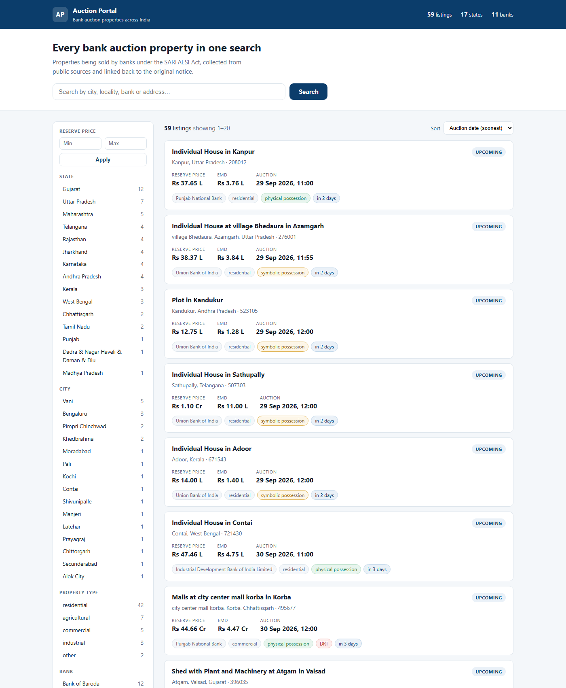

# Auction Portal

A centralised search portal for Indian bank auction listings — properties and
other assets sold by banks under the SARFAESI Act, 2002, aggregated from
publicly available sources into one searchable place.

Background research, the regulatory framework and the full build plan are in
[`docs/bank-auction-portal-full.pdf`](docs/bank-auction-portal-full.pdf)
(20 pages) with a 5-page summary alongside it.

---

## Status

**Milestone 5 of 6 — Search interface.** A working portal: search, filter
by bank, state, city, property type, possession and price, with a detail
page for every listing. Not yet scheduled or deployed.

| # | Milestone | State |
|---|-----------|-------|
| 1 | Foundation — repo, config, tests | **done** |
| 2 | Fetch & archive one source | **done** |
| 3 | Database | **done** |
| 4 | First real source adapter | **done** |
| 5 | Search UI | **done** |
| 6 | Scheduling, second source, deploy | next |



## Sources

| Source | Coverage | Status |
|---|---|---|
| [BAANKNET](https://baanknet.com) | 12 public sector banks + IBBI, ~72,000 properties | live |
| Bank notice PDFs (HDFC, Axis, ICICI) | private banks | Phase 2 |
| C1 India, AuctionTiger, MSTC | private banks and NBFCs | Phase 3 |

### Why BAANKNET first

- `robots.txt` is `User-agent: * / Disallow:` — everything is permitted
- it publishes sitemaps, so URLs come from the site telling crawlers what
  to fetch rather than from guesswork
- detail pages are server-rendered, so the structured record behind the
  page is available directly: no OCR, no LLM, no inference
- one source covers all 12 public sector banks

---

## Setup

Requires Python 3.12 or newer.

```powershell
# 1. Create an isolated environment
python -m venv .venv

# 2. Install the project and its development tools
.\.venv\Scripts\python.exe -m pip install -e ".[dev]"

# 3. Create your local configuration
Copy-Item .env.example .env
#    then edit .env and set CONTACT_EMAIL and CONTACT_URL

# 4. Set up a project-local PostgreSQL server
.\.venv\Scripts\python.exe scripts\setup_postgres.py

# 5. Apply the database schema
.\.venv\Scripts\python.exe -m alembic upgrade head

# 6. Confirm everything works
.\.venv\Scripts\python.exe -m pytest
```

On macOS or Linux, replace `.\.venv\Scripts\python.exe` with `.venv/bin/python`.

### The local database

`scripts/setup_postgres.py` downloads the official PostgreSQL portable
binaries into `.pgsql/` and runs a server on **port 5433**. No administrator
rights, no Windows service, and nothing that can collide with another
PostgreSQL on the machine. Everything it creates is git-ignored.

```powershell
.\.venv\Scripts\python.exe scripts\setup_postgres.py --status
.\.venv\Scripts\python.exe scripts\setup_postgres.py --start
.\.venv\Scripts\python.exe scripts\setup_postgres.py --stop
.\.venv\Scripts\python.exe scripts\setup_postgres.py --reset   # delete it all
```

The server does not start automatically when Windows boots. Run `--start`
after a reboot.

---

## Usage

```powershell
# Run the portal, then open http://127.0.0.1:8000
.\.venv\Scripts\python.exe -m auction_portal serve

# Show the loaded configuration
.\.venv\Scripts\python.exe -m auction_portal config

# Check the database connection and migration state
.\.venv\Scripts\python.exe -m auction_portal db

# Collect listings from a source
.\.venv\Scripts\python.exe -m auction_portal crawl baanknet --limit 50

# Browse what has been collected
.\.venv\Scripts\python.exe -m auction_portal listings --state Gujarat
.\.venv\Scripts\python.exe -m auction_portal listings --all   # include withheld

# Re-run parsing over archived documents. No network access at all.
.\.venv\Scripts\python.exe -m auction_portal reparse baanknet

# Fetch and archive a single document
.\.venv\Scripts\python.exe -m auction_portal fetch <url> --source-id hdfc_web

# Archive statistics
.\.venv\Scripts\python.exe -m auction_portal stats
```

Fetching the same URL twice reports `304` or `UNCHANGED` and stores nothing
new. That is the intended behaviour, and it is what keeps later parsing and
OCR costs down.

`reparse` is the reason raw bytes are archived immutably: when the parser
improves, history is reprocessed offline instead of re-crawled. No source
is contacted and nothing is lost.

### Withheld listings

A listing is only published when its confidence reaches 0.70. Anything
below that is stored but hidden, so the portal shows fewer listings rather
than a wrong price. On the first real crawl this caught a property whose
bank had uploaded a reserve price of Rs 1.

Use `--all` to see withheld listings and the flags that withheld them.

### The portal

Pages are server-rendered rather than a single-page app. Most traffic to a
portal like this arrives from people searching "SBI auction property Pune",
so complete HTML on the first response — indexable, fast, working without
JavaScript — matters more than client-side interactivity.

A JSON API is available at `/api/listings`, documented at `/api/docs`.

What every page guarantees, and what the tests enforce:

- **No borrower or guarantor names.** They add nothing for a buyer, and
  publishing someone's default is a real harm. The names are not stored on
  the listing at all, so no template change can leak them.
- **A link to the original notice** on every listing, plus when it was
  first seen and last verified.
- **A disclaimer** on every page, and a clear statement that we are not a
  bank, run no auctions and handle no EMD payments.
- **A warning on symbolic possession**, because the buyer may inherit an
  eviction, and on DRT or IBC sales, because a different legal process
  applies.

---

## Layout

```
src/auction_portal/
    config.py          Settings, loaded and validated from .env
    logging_setup.py   Logging configuration
    archiver.py        Fetch -> detect change -> archive -> record
    crawler.py         Runs a source adapter end to end; also reparse
    cli.py             Command line interface
    normalise/
        money.py       Indian rupee amounts (lakh/crore, 2-2-3 grouping)
        dates.py       Day-first Indian dates, IST handling
        area.py        sqft/sqyd/acre/hectare/guntha conversion
        geo.py         Coordinate validation against state bounding boxes
        text.py        Whitespace, mojibake, PIN codes, phone numbers
    search.py          Filters, facets, sorting, pagination
    web/
        app.py         FastAPI: HTML pages and JSON API
        templates/     Server-rendered pages
        static/        Stylesheet
    fetching/
        models.py      RawDocument, FetchResult
        robots.py      robots.txt compliance
        throttle.py    Per-domain rate limiting
        client.py      HTTP client: retries, backoff, conditional GET
    storage/
        raw_store.py   Immutable content-addressed archive
    db/
        models.py      Tables: source_documents, url_state, listings,
                       listing_revisions
        session.py     Engine and transaction handling
        repository.py  Document reads and writes
        listing_repository.py  Listing upsert and change history
    sources/
        base.py        SourceAdapter interface, ParsedListing
        flight.py      Reading Next.js server-rendered payloads
        baanknet.py    BAANKNET adapter
migrations/            Alembic schema migrations
scripts/               setup_postgres.py, probe.py, make_fixture.py
tests/                 Test suite
tests/fixtures/        Real archived pages with verified expected output
docs/                  Research and build plan
data/                  Downloaded documents (git-ignored, created at runtime)
.pgsql/                Local PostgreSQL server (git-ignored)
```

### Changing the schema

Never edit a table by hand. Change the models, then:

```powershell
.\.venv\Scripts\python.exe -m alembic revision --autogenerate -m "what changed"
.\.venv\Scripts\python.exe -m alembic upgrade head
```

The generated migration is committed to git, so every environment applies
the same change in the same order.

---

## Working on it

```powershell
.\.venv\Scripts\python.exe -m pytest          # run tests
.\.venv\Scripts\python.exe -m ruff check .    # lint
.\.venv\Scripts\python.exe -m ruff format .   # format
```

---

## Ground rules

These are deliberate and apply to every change:

1. **Raw downloaded data is never modified or deleted.** Parsers are rewritten
   often; re-downloading is not an option. Everything fetched is archived
   immutably and every later stage re-runs from that archive.
2. **No secrets in the repository.** All configuration comes from `.env`,
   which is git-ignored. `.env.example` documents the required keys.
3. **Dependencies are pinned exactly.** Upgrades are a reviewed change to
   `pyproject.toml`, never an accident.
4. **Every piece of logic has a test**, written at the same time as the code.
5. **We crawl politely.** We identify ourselves with a contact address, honour
   `robots.txt`, rate-limit every request, and never bypass a login, CAPTCHA
   or paywall.

---

## Legal note

This project republishes information that banks are legally required to
publish (Rule 8, Security Interest (Enforcement) Rules, 2002). Every listing
links back to its original notice. Nothing here is an offer to sell, and no
auction payments are handled.

A legal review is required before the portal is made publicly available. See
Part E of the full document.
